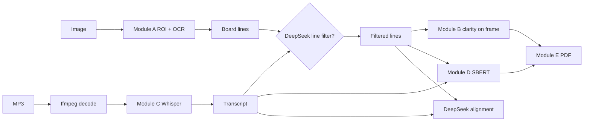
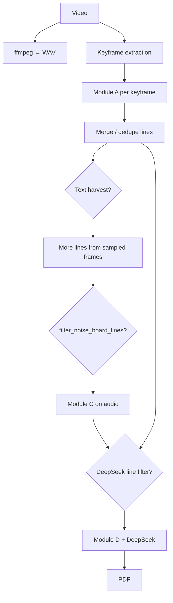

# Classroom blackboard analytics

End-to-end Python pipeline plus a small **FastAPI** web UI: locate the teaching surface in images or video, run **OCR**, transcribe **speech (Whisper)**, score **clarity**, compare board vs speech (**SBERT** + optional **DeepSeek**), and emit a **PDF** report.

---

## Table of contents

1. [What it does (modules)](#what-it-does-modules)
2. [End-to-end data flow](#end-to-end-data-flow)
3. [Video pipeline (detailed)](#video-pipeline-detailed)
4. [Configuration](#configuration)
5. [Directory layout](#directory-layout)
6. [Requirements](#requirements)
7. [Installation](#installation)
8. [Running](#running)
9. [Environment variables](#environment-variables)
10. [Troubleshooting](#troubleshooting)

---

## What it does (modules)

| Module | Role |
|--------|------|
| **A — Blackboard ROI + OCR** | Detects a board/slide region (custom **YOLOv8** weights if configured, else **YOLO-World** if enabled, else **heuristic** ink-blob / full frame). Runs line-wise OCR on the crop. Engine is selectable: **TrOCR** (handwriting / printed HF models), **EasyOCR**, or **PaddleOCR** (`trocr.ocr_engine` in YAML). |
| **B — Clarity** | Laplacian variance + stroke-width variance → readability score and short advice. |
| **C — Speech** | **OpenAI Whisper** on MP3 or extracted WAV; optional silence-based segmentation. **MP3 requires ffmpeg** on `PATH`. |
| **D — Semantic alignment** | **Sentence-Transformers** embedding similarity + token overlap → verdict (`highly_aligned` / `partially_related` / `content_mismatch`). |
| **D′ — DeepSeek (optional)** | Second opinion: relevance of speech vs full board text via chat API. |
| **D″ — DeepSeek line filter (optional)** | After Whisper, one API call can **drop noisy OCR lines** (UI chrome, junk fragments) using `speech_text` as weak context; see `deepseek.filter_board_lines`. |
| **E — PDF** | Bundles board lines, clarity, alignment (and error hints) into a report. |

**Video** reuses A–E: extract audio with ffmpeg, pick **keyframes** (YOLO-monitored sampling or time-based), run **A** per frame, optionally **merge** lines across frames and run a **text harvest** pass (extra sampled frames), then **C → filter → D / DeepSeek → E**.

---

## End-to-end data flow

### Still image + MP3



1. Load `config/default.yaml` (CLI sets cwd to project root; web server loads the same file on each request unless overridden later).
2. **Module A** on the full frame → ROI + list of text lines.
3. **Module B** on the same frame → clarity metrics.
4. **Module C** on the audio file → `speech_text` + segments.
5. If **`deepseek.filter_board_lines`**: send numbered lines + speech to DeepSeek; keep only indices in `kept_indices`.
6. Join cleaned lines → `board_as_paragraph`; run **Module D** and **DeepSeek alignment**.
7. **Module E** builds the PDF.

### Video file



---

## Video pipeline (detailed)

1. **Audio**  
   `ffmpeg` writes a mono 16 kHz WAV in a temp directory. Whisper consumes it.

2. **Keyframes** (`video.*` in YAML)  
   - **`keyframe_source: yolo_monitor`**: stride through the video, optionally use YOLO / YOLO-World to propose ROI sizes; score frames by clarity + frame difference; keep up to **`max_keyframes`**.  
   - Fallback modes include uniform sampling or I-frame sampling (`iframe_max_decode`).

3. **Per keyframe — Module A**  
   - If **`video_prefer_printed_model`**: primary OCR uses the **printed** TrOCR checkpoint when `ocr_engine` is `trocr`; if `ocr_engine` is `easyocr` / `paddleocr`, that engine runs on the **ROI crop**.  
   - Weak result → optional **full-frame handwriting TrOCR** fallback.

4. **Aggregation**  
   - **`board_text_mode`**: e.g. `merged` (pool lines across frames) vs `best` / `best_clarity` (single best frame’s lines).  
   - **`_dedupe_subsumed_lines`** removes substring duplicates.  
   - **`text_harvest_*`**: periodically sample more frames, run **Module A** + optional full-frame OCR pass to recover extra slide text (can add noise; tune or disable).

5. **Optional rule filter**  
   `filter_noise_board_lines` + `noise_line_*` drops very short / low-letter lines.

6. **Whisper → DeepSeek line filter → alignment → PDF**  
   Same as the still-image path from step 4 onward.

7. **Debug**  
   If `video.debug_enabled`, images land under `web_uploads/.../video_*_debug/` (full frame, ROI overlay, OCR input, mask) plus `metadata.json`.

---

## Configuration

| File / mechanism | Purpose |
|------------------|---------|
| **`config/default.yaml`** | Single source of defaults for CLI and web (loaded by `blackboard_analytics.config_loader`). |
| **`.env`** at project root (gitignored) | `DEEPSEEK_API_KEY=...` (and optional overrides). Never commit secrets. |
| **CLI `--config path.yaml`** | `run_analysis.py` merges/overrides with that file. |
| **`BLACKBOARD_VIDEO_FAST=1`** | Forces video fast preset (fewer keyframes / lighter harvest) even if YAML says `fast_mode: false`. |

Important YAML groups:

- **`yolo` / `yolo_world`**: detector weights and open-vocabulary slide prompts.  
- **`trocr`**: `ocr_engine` (`trocr` \| `easyocr` \| `paddleocr`), languages, `device`, video printed preference.  
- **`whisper`**: model size, language, segmentation.  
- **`video`**: keyframes, harvest, merge, noise filter, debug.  
- **`deepseek`**: API URL, model, `filter_board_lines`, timeouts.

---

## Directory layout

```
classroom_blackboard_analytics/
  config/default.yaml      # defaults
  scripts/                 # run_web.py, run_analysis.py, tunnel helper, *.cmd (Windows)
  src/blackboard_analytics/
    pipeline.py            # orchestration (image, video)
    module_a_blackboard_ocr.py
    module_a_alt_ocr.py    # EasyOCR / PaddleOCR
    module_b_clarity.py
    module_c_whisper.py
    module_d_semantic.py
    module_d_deepseek.py   # alignment + line filter API
    module_e_report.py
    module_video_keyframes.py
    model_cache.py         # HF cache paths; forces PyTorch-only for transformers
    config_loader.py
  web/                     # FastAPI server + static UI
  models/                  # optional committed .pt weights (see .gitignore)
  .model_cache/            # downloaded models (gitignored)
  web_uploads/             # browser uploads (gitignored)
```

---

## Requirements

- **Python**: 3.9+ (3.10+ recommended).  
- **ffmpeg**: on `PATH` for MP3 and video audio (e.g. Windows: `winget install Gyan.FFmpeg`).  
- **GPU**: optional; CPU is slower for TrOCR, Whisper, and YOLO.  
- **CUDA PyTorch**: for NVIDIA GPUs, install torch/torchvision from the [PyTorch wheel index](https://download.pytorch.org/whl/) after reading comments in `requirements.txt`.  
- **EasyOCR / PaddleOCR**: listed in `requirements.txt`; if Paddle fails to install on your OS, use `ocr_engine: easyocr` only.

---

## Installation

```bash
cd classroom_blackboard_analytics
python -m venv .venv
# Windows PowerShell:
#   .\.venv\Scripts\Activate.ps1
pip install -U pip
pip install -r requirements.txt
pip install -e .
```

If this repo lives inside a parent folder that already has a **`venv`**, you may use that interpreter instead; **`scripts/run_web_public_tunnel.py`** also searches the **parent** `venv` / `.venv` when spawning the web process.

Copy **`.env.example`** to **`.env`** if you add one locally, and set:

```env
DEEPSEEK_API_KEY=your_key_here
```

---

## Running

### Command line

Always run from the **project root** (or rely on `run_analysis.py` / `run_web.py` changing cwd to root).

```bash
# Still image + MP3
python scripts/run_analysis.py --image frame.jpg --audio clip.mp3 --pdf output/report.pdf

# Video (audio extracted automatically)
python scripts/run_analysis.py --video lesson.mp4 --pdf output/report.pdf

# Custom YAML
python scripts/run_analysis.py --video lesson.mp4 --pdf out/report.pdf --config config/default.yaml
```

JSON is printed to stdout; PDF path is inside the payload.

### Web UI

```bash
python scripts/run_web.py
```

- Default bind: **`0.0.0.0:8766`** (LAN).  
- Localhost only: `python scripts/run_web.py --local` or `--host 127.0.0.1`.  
- Port: `--port 8766` or env `BLACKBOARD_WEB_PORT`.

Open **http://127.0.0.1:8766** (or your machine’s LAN IP).

**Windows shortcuts:** `scripts\run_web.cmd` / `scripts\run_analysis.cmd` (expect `.venv` under this project).

### Public HTTPS (Cloudflare quick tunnel)

Requires **`cloudflared`** on `PATH`.

```bash
python scripts/run_web_public_tunnel.py
# Optional: --port 8767
```

The script starts **local** `run_web.py` then **`cloudflared tunnel --url http://127.0.0.1:<port>`**.  
If the port is already in use, stop the old Python process or pick another port. Quick tunnels are **not** for production SLA.

### Smoke test

```bash
python scripts/smoke_test_env.py
```

---

## Environment variables

| Variable | Effect |
|----------|--------|
| `DEEPSEEK_API_KEY` | DeepSeek API key (or use `.env`). |
| `BLACKBOARD_WEB_HOST` | Default bind address for `run_web.py`. |
| `BLACKBOARD_WEB_PORT` | Default port for web and tunnel helper. |
| `BLACKBOARD_VIDEO_FAST` | `1` / `true` → force fast video preset. |
| `HF_HUB_DISABLE_SYMLINKS_WARNING` | Set to `1` on Windows if symlink warnings annoy (optional). |

---

## Troubleshooting

| Symptom | What to check |
|---------|----------------|
| `ModuleNotFoundError: uvicorn` / `fastapi` | Use this project’s venv; `pip install -r requirements.txt`. |
| Port **10048** / address in use | Another `run_web.py` is running; `netstat -ano \| findstr :8766` then stop the PID or change `--port`. |
| `ffmpeg not found` | Install ffmpeg and reopen the terminal. |
| TrOCR / transformers TensorFlow / Keras errors | This repo sets **PyTorch-only** flags in `model_cache.py`; upgrade **torch ≥ 2.1**. |
| PowerShell `Activate.ps1` fails | Use `.\.venv\Scripts\Activate.ps1` (not `activate` without `.ps1`). |
| DeepSeek errors | Key in `.env`, network to `api.deepseek.com`; disable `deepseek.enabled` or `filter_board_lines` to test without API. |
| OCR too noisy | Lower `text_harvest_*`, enable `filter_noise_board_lines`, or tune `deepseek.filter_board_lines`; try `ocr_engine` / languages in YAML. |
| cloudflared unstable | Network/firewall/QUIC; use LAN URL with `--host 0.0.0.0` or a named Cloudflare tunnel for production. |

---

## License / credits

Course / group project code. Third-party models (TrOCR, Whisper, Ultralytics, Hugging Face, EasyOCR, PaddleOCR, DeepSeek API) remain under their respective licenses and terms of use.
