```mermaid
graph TB
    subgraph Navigation["🧭 App Navigation Structure"]
        direction TB
        Root["App Root<br/>RootLayout.tsx"]
        
        Root --> Tabs["(tabs) Layout<br/>5 Main Screens"]
        Root --> Modal["Modal Screen<br/>Optional Pages"]
        
        Tabs --> Screen1["📍 Path<br/>index.tsx"]
        Tabs --> Screen2["🃏 Cards<br/>cards.tsx"]
        Tabs --> Screen3["⬆️ Upload<br/>upload.tsx"]
        Tabs --> Screen4["📹 Shorts/Reels<br/>shorts.tsx"]
        Tabs --> Screen5["🎵 Player<br/>player.tsx"]
        Tabs --> Screen6["👤 Profile<br/>profile.tsx"]
        
        Modal --> Modal1["Settings Modal"]
        Modal --> Modal2["Help Modal"]
        Modal --> Modal3["About Modal"]
    end
    
    subgraph State["🔄 State Management"]
        direction TB
        State1["AsyncStorage<br/>Persistent Data"]
        State2["React useState<br/>UI State"]
        State3["useFocusEffect<br/>Screen Focus"]
        State4["Animated API<br/>Animations"]
    end
    
    subgraph APIs["🌐 External APIs"]
        direction TB
        API1["Google Gemini<br/>Content Generation"]
        API2["Text-to-Speech<br/>Audio Generation"]
        API3["Firebase<br/>Cloud Storage"]
        API4["Expo Router<br/>Navigation"]
    end
    
    subgraph Components["🧩 Shared Components"]
        direction TB
        Comp1["HapticTab<br/>Haptic Feedback"]
        Comp2["ThemedText<br/>Typography"]
        Comp3["ThemedView<br/>Styled Containers"]
        Comp4["Ionicons<br/>UI Icons"]
    end
    
    Screen1 -.->|Uses| State1
    Screen2 -.->|Uses| State1
    Screen4 -.->|Uses| State1
    Screen5 -.->|Uses| State1
    Screen6 -.->|Uses| State1
    
    Screen3 -->|Calls| API1
    Screen3 -->|Calls| API2
    Screen3 -->|Saves to| API3
    
    Tabs -->|Navigation| Comp1
    Screen1 -->|Displays with| Comp2
    Screen1 -->|Styled| Comp3
    Screen1 -->|Icons| Comp4
    
    State4 -->|Powers| Screen5
    State4 -->|Powers| Screen1
    
    classDef tab fill:#2196F3,stroke:#1565C0,stroke-width:2px,color:#fff
    classDef state fill:#4CAF50,stroke:#2E7D32,stroke-width:2px,color:#fff
    classDef api fill:#FF9800,stroke:#E65100,stroke-width:2px,color:#fff
    classDef comp fill:#9C27B0,stroke:#6A1B9A,stroke-width:2px,color:#fff
    classDef root fill:#00BCD4,stroke:#0097A7,stroke-width:2px,color:#fff
    
    class Screen1,Screen2,Screen3,Screen4,Screen5,Screen6 tab
    class State1,State2,State3,State4 state
    class API1,API2,API3,API4 api
    class Comp1,Comp2,Comp3,Comp4 comp
    class Root,Tabs root
```

---

## App Navigation Architecture

### 🧭 **Navigation Structure**
- **Root Layout**: Main app entry point
- **Tabs Layout**: 5-6 main screens with bottom navigation
- **Modal Screens**: Optional dialogs and settings

### **Screen Hierarchy**

#### **Bottom Tab Navigation (5 Screens)**
1. **📍 Path** (`index.tsx`) - Study path visualization
2. **🃏 Cards** (`cards.tsx`) - Flashcard review
3. **⬆️ Upload** (`upload.tsx`) - PDF upload center
4. **📹 Shorts** (`shorts.tsx`) - Reels mode
5. **🎵 Player** (`player.tsx`) - Audio playback
6. **👤 Profile** (`profile.tsx`) - User account & settings

#### **Modal Screens (Overlays)**
- Settings Modal
- Help & FAQ Modal
- About App Modal

### 🔄 **State Management Strategy**

**AsyncStorage (Persistent)**
- `studyData` - All courses and study data
- `selectedCourse` - Currently selected course
- `userProfile` - User info and preferences
- `badgeData` - Achievement badges
- `diamonds` - Currency tracking

**React State (Temporary)**
- UI states (loading, errors)
- User interactions
- Form inputs
- Modal visibility

**Animated API**
- Sun rotation (ambient animation)
- Earth rotation (background)
- Stars twinkling (atmosphere)
- CD player spinning

### 🌐 **External Integrations**

**Google Gemini API**
- Content analysis
- Flashcard generation
- Quiz creation
- Summary writing

**Text-to-Speech API**
- PDF narration
- Audio synthesis
- Quality normalization

**Firebase Cloud Storage**
- PDF backups
- Media file storage
- Cross-device sync

**Expo Router**
- Navigation management
- Deep linking
- Screen transitions

### 🧩 **Reusable Components**

**HapticTab** - Tactile feedback on tab press
**ThemedText** - Typography system
**ThemedView** - Styled containers
**Ionicons** - 5000+ UI icons library

---

## Data Flow Between Screens

```
Upload Tab
    ↓ (PDF + AI generates content)
    ↓
AsyncStorage (studyData)
    ↓ (Data cached locally)
    ├→ Path Tab (reads & displays study path)
    ├→ Cards Tab (reads & displays flashcards)
    ├→ Shorts Tab (reads & displays videos)
    └→ Player Tab (reads & displays audio)

Profile Tab
    ├→ Settings Modal
    │   └→ Can clear AsyncStorage
    ├→ Help Modal
    └→ About Modal
```
