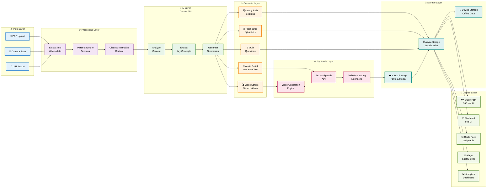

---

## Data Flow Architecture Explained

### 📥 **Input Layer**
- Users upload PDFs, scan with camera, or import from URLs
- Multiple input methods for flexibility

### ⚙️ **Processing Layer**
- Extract raw text and metadata from PDFs
- Parse document structure (chapters, sections, headings)
- Clean and normalize content for AI processing

### 🤖 **AI Layer (Gemini API)**
- Analyze content comprehensively
- Extract key concepts and definitions
- Generate summaries and explanations

### ✨ **Generate Layer**
- **Study Path**: Break content into progressive sections
- **Flashcards**: Create Q&A pairs for spaced repetition
- **Video Scripts**: Generate 90-second summary videos
- **Quiz**: Generate practice questions with answers
- **Audio Script**: Create narration text for TTS

### 🔊 **Synthesis Layer**
- **Text-to-Speech**: Convert audio scripts to natural speech
- **Video Generation**: Create visual content from scripts
- **Audio Processing**: Normalize and optimize audio quality

### 💾 **Storage Layer**
- **Cloud Storage**: Backup PDFs and generated media
- **AsyncStorage**: Local caching for quick access
- **Device Storage**: Offline access to downloaded content

### 📲 **Display Layer**
- **Study Path**: Interactive S-curve visualization
- **Flashcards**: Flip and review cards
- **Reels**: Swipeable short-form videos
- **Player**: Spotify-style audio playback
- **Analytics**: Track progress and statistics
```

Now let me create a third diagram for the app navigation structure:
