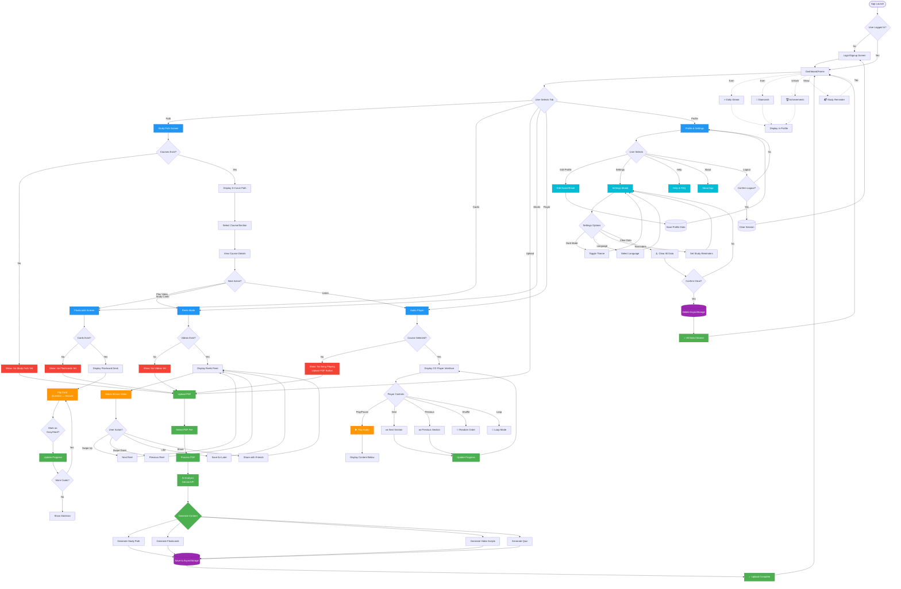

```mermaid
graph TD
    Start([App Launch]) --> Auth{User Logged In?}
    Auth -->|No| Login[Login/Signup Screen]
    Auth -->|Yes| Dashboard[Dashboard/Home]
    Login --> Dashboard
    
    Dashboard --> NavBar{User Selects Tab}
    
    %% Main Navigation Paths
    NavBar -->|Path| PathTab[Study Path Screen]
    NavBar -->|Cards| CardsTab[Flashcards Screen]
    NavBar -->|Upload| UploadTab[Upload PDF]
    NavBar -->|Shorts| ShortsTab[Reels Mode]
    NavBar -->|Player| PlayerTab[Audio Player]
    NavBar -->|Profile| ProfileTab[Profile & Settings]
    
    %% Upload Flow
    UploadTab --> SelectPDF[Select PDF File]
    SelectPDF --> ProcessPDF[Process PDF]
    ProcessPDF --> AIAnalysis[AI Analysis<br/>Gemini API]
    AIAnalysis --> Generate{Generate Content}
    
    Generate --> GenPath[Generate Study Path]
    Generate --> GenCards[Generate Flashcards]
    Generate --> GenVideos[Generate Video Scripts]
    Generate --> GenQuiz[Generate Quiz]
    
    GenPath --> SaveDB[(Save to AsyncStorage)]
    GenCards --> SaveDB
    GenVideos --> SaveDB
    GenQuiz --> SaveDB
    
    SaveDB --> Success[✓ Upload Complete]
    Success --> Dashboard
    
    %% Study Path Flow
    PathTab --> CheckCourses{Courses Exist?}
    CheckCourses -->|No| EmptyPath[Show: No Study Path Yet]
    CheckCourses -->|Yes| ShowPath[Display S-Curve Path]
    
    ShowPath --> SelectCourse[Select Course/Section]
    SelectCourse --> ViewContent[View Course Details]
    ViewContent --> PlayOrCards{Next Action?}
    PlayOrCards -->|Play Video| ShortsTab
    PlayOrCards -->|Study Cards| CardsTab
    PlayOrCards -->|Listen| PlayerTab
    
    EmptyPath --> UploadTab
    
    %% Flashcards Flow
    CardsTab --> CheckCards{Cards Exist?}
    CheckCards -->|No| EmptyCards[Show: No Flashcards Yet]
    CheckCards -->|Yes| ShowCards[Display Flashcard Deck]
    
    ShowCards --> FlipCard[Flip Card<br/>Question ↔ Answer]
    FlipCard --> RateCard{Mark as:<br/>Easy/Hard?}
    RateCard --> UpdateProgress[Update Progress]
    UpdateProgress --> NextCard{More Cards?}
    NextCard -->|Yes| FlipCard
    NextCard -->|No| CardStats[Show Statistics]
    
    EmptyCards --> UploadTab
    
    %% Reels/Shorts Flow
    ShortsTab --> CheckVideos{Videos Exist?}
    CheckVideos -->|No| EmptyVideos[Show: No Videos Yet]
    CheckVideos -->|Yes| ShowReels[Display Reels Feed]
    
    ShowReels --> WatchReel[Watch 90-sec Video]
    WatchReel --> ReelAction{User Action?}
    ReelAction -->|Swipe Up| NextReel[Next Reel]
    ReelAction -->|Swipe Down| PrevReel[Previous Reel]
    ReelAction -->|Like| SaveReel[Save for Later]
    ReelAction -->|Share| ShareReel[Share with Friends]
    
    NextReel --> ShowReels
    PrevReel --> ShowReels
    SaveReel --> ShowReels
    ShareReel --> ShowReels
    
    EmptyVideos --> UploadTab
    
    %% Audio Player Flow
    PlayerTab --> CheckCourse{Course Selected?}
    CheckCourse -->|No| EmptyPlayer[Show: No Song Playing<br/>Upload PDF Button]
    CheckCourse -->|Yes| PlayerUI[Display CD Player Interface]
    
    PlayerUI --> PlayerCtrl{Player Controls}
    PlayerCtrl -->|Play/Pause| PlayAudio[▶️ Play Audio]
    PlayerCtrl -->|Next| SkipForward[⏭️ Next Section]
    PlayerCtrl -->|Previous| SkipBack[⏮️ Previous Section]
    PlayerCtrl -->|Shuffle| ToggleShuffle[🔀 Random Order]
    PlayerCtrl -->|Loop| CycleLoop[🔁 Loop Mode]
    
    PlayAudio --> ShowLyrics[Display Content Below]
    SkipForward --> UpdateProgress2[Update Progress]
    SkipBack --> UpdateProgress2
    
    UpdateProgress2 --> PlayerUI
    
    EmptyPlayer --> UploadTab
    
    %% Profile & Settings Flow
    ProfileTab --> ProfileMenu{User Selects}
    
    ProfileMenu -->|Edit Profile| EditProfile[Edit Name/Email]
    ProfileMenu -->|Settings| SettingsModal[Settings Modal]
    ProfileMenu -->|Help| HelpModal[Help & FAQ]
    ProfileMenu -->|About| AboutModal[About App]
    ProfileMenu -->|Logout| LogoutConfirm{Confirm Logout?}
    
    SettingsModal --> SettingsOptions{Settings Options}
    SettingsOptions -->|Dark Mode| ToggleDarkMode[Toggle Theme]
    SettingsOptions -->|Language| ChangeLanguage[Select Language]
    SettingsOptions -->|Reminders| SetReminders[Set Study Reminders]
    SettingsOptions -->|Clear Data| ClearData[⚠️ Clear All Data]
    
    ClearData --> ConfirmClear{Confirm Clear?}
    ConfirmClear -->|Yes| DeleteData[(Delete AsyncStorage)]
    ConfirmClear -->|No| SettingsModal
    DeleteData --> DataCleared[✓ All Data Cleared]
    DataCleared --> Dashboard
    
    EditProfile --> SaveProfile[(Save Profile Data)]
    SaveProfile --> ProfileTab
    
    ToggleDarkMode --> SettingsModal
    ChangeLanguage --> SettingsModal
    SetReminders --> SettingsModal
    
    LogoutConfirm -->|Yes| ClearSession[(Clear Session)]
    ClearSession --> Login
    LogoutConfirm -->|No| ProfileTab
    
    %% Gamification Elements
    Dashboard -.->|Earn| Streak[🔥 Daily Streak]
    Dashboard -.->|Earn| Diamonds[💎 Diamonds]
    Dashboard -.->|Unlock| Badges[🏆 Achievements]
    
    Streak -.-> Profile[Display in Profile]
    Diamonds -.-> Profile
    Badges -.-> Profile
    
    %% Notifications
    Dashboard -.->|Show| Notif[📬 Study Reminder]
    Notif -.->|Tap| Dashboard
    
    %% Styling
    classDef upload fill:#4CAF50,stroke:#2E7D32,color:#fff
    classDef study fill:#2196F3,stroke:#1565C0,color:#fff
    classDef action fill:#FF9800,stroke:#E65100,color:#fff
    classDef error fill:#F44336,stroke:#C62828,color:#fff
    classDef success fill:#4CAF50,stroke:#2E7D32,color:#fff
    classDef database fill:#9C27B0,stroke:#6A1B9A,color:#fff
    classDef modal fill:#00BCD4,stroke:#0097A7,color:#fff
    
    class UploadTab,SelectPDF,ProcessPDF,AIAnalysis,Generate upload
    class PathTab,CardsTab,ShortsTab,PlayerTab,ProfileTab study
    class FlipCard,WatchReel,PlayAudio action
    class EmptyPath,EmptyCards,EmptyVideos,EmptyPlayer error
    class Success,DataCleared,UpdateProgress,UpdateProgress2 success
    class SaveDB,DeleteData database
    class EditProfile,SettingsModal,HelpModal,AboutModal modal
```

Now let me create a second diagram showing the data flow architecture:
